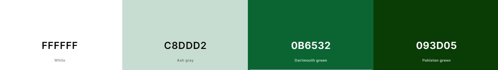
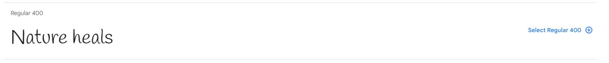
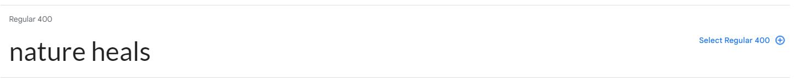
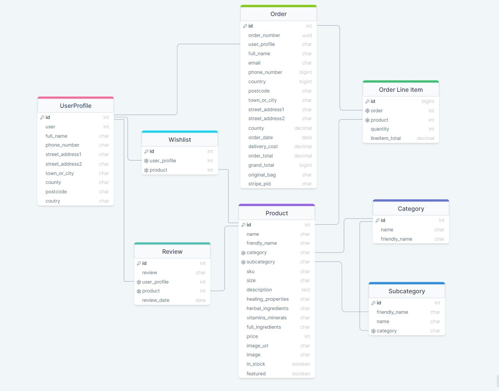

# *Nature heals Cosmetics and Essential Oils* 

Link to the page: [Nature Heals](https://nature-heals-89c8f732e59d.herokuapp.com/)

# Project Overview 
Nature heals cosmetics and essential oils is devoted to improving people's health and state of wellbeing through nature. They strongly believe in its healing power and their aim is to use it for the benefit of others. Therefore their products are made of natural ingredients and range from creams to syrups and essential oils which are enriched with the extracts from herbs, flowers and fruits.
All of the ingredients are selected carefully to combat a variety of problems such as inflammation, immunity, stress, concentration, sleep or skin problems.
Their high quality products can be used not only to help with the existing problems but as a prevention of a variety of diseases.

# Table of Content

- [Project Overview](#project-overview)
- [Project objectives](#project-objectives)
   - [User Goals](#user-goals)
   - [Site Owner Goals](#site-owner-goals)  
- [User Experience](#user-experience)
   - [Target user](#target-user)  
   - [Navigation ](#navigation)
   - [Product viewing, searching and selecting](#product-viewing-searching-and-selecting)
   - [Selecting, Purchasing products and checkout](#selecting-purchasing-products-and-checkout)
   - [Product management (admin only)](#product-management-admin-only)
   - [User’s activity  management (admin only)](#users-activity-management-admin-only)      
- [Design](#design)  
   - [Design choices](#design-choices)  
   - [Color Scheme](#color-scheme)
   - [Typography](#typography)  
   - [Imagery](#imagery)    
- [Database Scheme & User Journey](#database-scheme-&-user-journey)
   - [User Journey](#user-journey) 
   - [Database Scheme](#database-scheme) 
- [Wireframes](#wireframes)
- [Features](#features)
   - [Header](#header)
   - [Footer](#footer)
   - [Regidter page](#register-page)
   - [Log in/ Log out page](#log-in-log-out-page)
   - [Home page](#home-page)
   - [All products page](#all-products-page)
   - [Product detail page](#product-detail-page)
   - [Profile page](#profile-page)
   - [Wishlist page](#wishlist-page)
   - [Card](#card)
   - [Bag](#bag)
   - [Checkout](#checkout)
   - [Checkout success](#checkout-success)
   - [Message section](#messagesection)
   - [Add product (admin only)](#add-product-(admin-only))
   - [Edit product (admin only)](#edit-product-(admin-only))
   - [Checkout](#checkout)
   - [Checkout](#checkout)   
- [Technologies Used](#technologies-used)
   - [Languages Used](#languages-used)
   - [Frameworks, libraries and programs used](#frameworks,-libraries-and-programs-used)
- [Testing](#testing)
- [Deployment & local development](#deployment-&-local-development)
   - [Deployment](#deployment)
   - [Local Development](#local-development)
      - [How to Fork](#how-to-fork)
      - [How to Clone](#how-to-clone)
- [Credits](#credits)
- [Aknowledgement](#aknowledgement)

# Project objectives 

## User Goals 

### Target user 

* People seeking natural remedies to their problems 
* People who want to improve their health 
* People who want to use cosmetics based on natural ingredients

### Navigation 

1.	I want it to be easy to register, login and logout 
2.	I want it to be easy to access my profile 
3.	I want it to be easy to access my Wishlist
4.	I want to be notified when I click on something and the action is successful
5.	I want to be notified when I select something 
6.	I want to be able to navigate site easily and that links and buttons to work
7.	I want to access some specific products easily  

### Product viewing, searching and selecting  

8.	I want to see all available products
9.	I want to be able to quickly access a specific product (categories, Wishlist) 
10.	I want to be able to search product directly
11.	I want to be able to sort product based on price, category name or size
12.	I want be able to find out more about the product 
13.	I want to see what other people think about the product
14.	I want to see what the product consists of 
15.	I want to be able to write my opinion about the product
16.	I want to be able to edit my review
17.	I want to be able to delete review 
18.	I want to be able to add items to my wishlist 
19.	I want to be able to delete items from my wishlisth

### Selecting, Purchasing products and checkout

20.	I want to be able to see what products I have selected for payment
21.	I want to be able to see the total payment amount of  selected  products easily at any time
22.	I want to be able to add or remove items from my shopping bag easily
23.	I want to see the summary of the total payment amount for items I have selected
24.	I want confirmation whether my requests on the website were completed
25.	I want to see if there are any discounts 
26.	I want to see my previous purchases
27.	I want to be able to save my delivery information
28.	I want to be able to save products so I can buy them later
29.	I want to be able to see my products before I confirm the payment 
30.	I want the payment to be secure
31.	I want confirmation whether my purchase has been successful
32.	I want to be able to buy products even when I am not registered 

### Product management (admin only)

33.	I want to be able to add products on the website itself.
34.	I want to be able to edit products on the website itself.
35.	I want to be able to delete products on the website itself.

### User’s activity  management (admin only)

36.	I want users to register and create their account. 
37.	I want to be able to view, edit or delete user’s comments.
38.	I want only logged in users to be able to add the comment 
39.	I want to receive a warning if when I unintentionally click delete button.
40.	I want only logged in users to be able to user their Wishlist
41.	I want users to have pleasant experience on my site and make it easy for them to purchase product.
42.	I want users to be able to access my site on variety of devices 
43.	I want users to be able to access my site on variety of browsers
44.	I want users to provide they delivery address before they complete the purchase
45.	I want the user to be notified when the payment details, they provide, are not correct 
46.	Prevent errors with payment (e.g. prevent placing order but stopping payment, or charging the customer twice)

# Design 

## Design choices

The site will be visited by people who are looking for products made of natural ingredients which could help with their health or skin problems. Therefore, the design elements evoke the feeling of nature and purity as well as solution to their problems. 

## Color Scheme 

The main colors of the website are different shades of green and white. Ash grey green is used for card-outline and to make certain containers stand out. Dartmouth green is used for header, footer and buttons. Pakistan green is used for the banner in order to make it stand out. 

## Typography 

Google Fonts website was used to import the fonts chosen for this website. Lato was used as a general font for the website. Handlee was used for headers and for the quote. San seriff was added in case browser doesn't support the other two fonts. 

## Imagery

The product images in this project were generated by text to image tool from [Runway](https://runwayml.com/), and the rest of the images was taken from [AdobeStock ](https://stock.adobe.com/uk/) and [Pexels](https://www.pexels.com/)

# Database Scheme & User Journey
## User Journey

## Database Scheme 

# Features

## Header

* Repeats on all the pages 
* Positioned on the top of the page
* Logo is positioned on the left
* Search bar allows the user to locate certain products easily
* Account, Wishlist and bag options are on the right for the user to be quickly directed to the pages of interes
* Main nav enables user to filter the products as well as narrow the search down by category
* Relates to following user stories: 1,4,6,7

## Footer

* Repeats on all the pages 
* Positioned on the bottom of the page
* Contains logo, subcategory links, address and opening hours
* Relates to following user stories: 6

## Register page  

### Registration Form
* Form is positioned in the middle of the screen
* Opens when user clicks Register link in the Login page or Log in link in navigation menu
* Form contains 4 input fields - username, email address, password and repeat password
* Each input field has a label with information required for that field 
* A form with empty fields will not be submitted and a message prompting the user to fill the field will appear 
* Register button  performs the registration, data flow to database and directs users to log in page
* The message will appear when registration is successfull 
* Log in link is positioned at the top for quick navigation and directs the user to Log in page
* A verification email is sent to the user when 
* Relates to following user stories: 1,4,6

## Log in/ Log out page

### Log in Form

* Form is positioned in the middle of the screen
* Opens when user clicks Login link in the  Register page or clicks on Log In in navigation menu
* Form contains 2 input fields - username and password
* Each input field has a label with information required for that field 
* After log in the user is directed to the products page 
* A form with empty fields will not be submitted and a message prompting the user to fill the field will appear 
* Information icon on the right side of the password field shows the password requirements  when hovered over (see register section for more information)
* Register  link is positioned at the bottom for quick navigation and directs the user to the user to Registered page
* Relates to following user stories: 1,4,6

### Log out

* Opens when user clicks Login link in the Log out option in the Accounts dropdonw
* Logs the user out when they confirm they click on log out button
* Home button will direct the user to the index page

## Home page 
*

### Hero image

* Atracts site visitor's attention
* Indications that this website is for cosmetics and oils with herbal and natural ingredients
* Shop now button promts the user to browse the products 
* Takes up about 1/3 of the sreensize to allow content hinting

###	Popular products sections

* Shows 4 randomly selected featured products
* View all products button prompts the user to browse more products
* Relates to following user stories: 6

### Our promise section and quote section
* Outlines the principles of the company 
* Icons were added for easier comprehension
* Quote reinforces the importance of nature in healing process

### Categories section
* List of link which direct the user to All products page with selection of the product per category
* Images aid the intuitive navigation
* Relates to following user stories: 8, 9,11

## All products page

### Card

* Contains product image, name, size, category tag and price information
* View product button takes the user to the product detail page
* Has a light green shadow
* When hovered over the shadow turns to dark green
* On mobile devices only 1 card is displayed and up to 4 cards displayed on widers screens
* Heart icon indicates to the logged in user which products they have selected in their wishlist
* Clicking the empty heart icon enables user to add the product to the wishlist
* Clicking the full heart icon enables user to delete the product from the wihslist
* Relates to following user stories: 3, 8, 9
 
## Product detail page

### Product detail section

* On the left tha page  contains product image on the left and the healing benefits list under it
* On the right the page contains the product name, category tag, product desciption, product price and the quantity box
* Quantity box enables to increase or decrease the product amount 
* Add to bag button next to the quatity box adds the product to the bag 
* Continue shopping button allows the user to return to the all products page
* Edit and Delete button placed under the continue shopping button to allow the admin to edit or delete the product
* Edit button directs admin to the Edit form
* Delete button triggers a modal window where admin can confirm that they want to go ahead with the deletion
* Relates to following user stories: 10, 12, 14, 34, 35, 37, 38, 39

### Customer review section

* The list of customer reviews is positioned on the left 
* When there are no reviews, a text prompting user to add their reviews is shown
* Edit (pen icon) and delete (cross) are displayed below the comment to the author of the comment only
* Edit button triggers a modal window where the user can edit their review
* Delete button triggers a confirmation modal window where the user can confirm the deletion of the review
* A section with text area where user can write their review is positioned on the right
* Add review button adds the review to the database and the review gets displayed on the right
* Relates to following user stories: 13, 15, 16, ,17

## Profile page

* Contains the customer contact information form on the left
* The customer can update their shipping information by typing new details and clicking the update information button
* Contains order history on the right 
* When the user click on the order number they will be taken to the page with the order details
* Relates to following user stories: 26, 27, 36

## Wishlist page

* Contiais cards with shortlisted products
* Can be accesed directly from the top navbar

### Card

* Contains product image, name, size, category tag and price information
* View product button takes the user to the product detail page
* Has a light green shadow
* When hovered over the shadow turns to dark green
* On mobile devices only 1 card is displayed and up to 4 cards displayed on widers screens
* Heart icon indicates to the logged in user which products they have selected in their wishlist
* Clicking the empty heart icon enables user to add the product to the wishlist
* Clicking the full heart icon enables user to delete the product from the wihslist
* Relates to following user stories: 3, 9, 18, 19, 28, 36, 40

## Bag

* Contains a list of products selected for the purchase
* Product image, name, price per unit, quanity box, total price are displayed on the right and under one under for smaller screens
* Product amount can be increased or decreased by clicking on + or - button respectively
* Summary box is displayed on the right for larger screen with total net, vat and gross payment shows the total amount for the selected products at all times
* Total amount summary is displayed at the bottom of the list and just above secure payment button for the user to know their amount they are going to pay before they move to the payment
* The total amount under the bag icon in nav menu updates each time the product is added, or removed and is visible on any page
* Relates to following user stories: 20, 21, 22, 23, 41

## Checkout

* Contains the list of products selected for purchase on the right
* Contains the shipping information form on the left
* The user can save the billing information by clicking save billing information button
* Payment section is displayed under the shipping form
* The card details need to be entered in payment section
* When incorrect details are entered the user is notified
* The text under the Pay now button reiterates to the user the total amount which will be deducted from the users account
* When the pay now button is clicked the loading screen appears and the user is not able to click anything else
* Relates to following user stories: 20, 30, 32, 36, 41, 44, 45, 46

## Checkout success

* Is received when the purchase is completed successfully 
* Contains Thank you message on the top and the information where the email will be sent to 
* Contains the order number and list of products 
* Relates to following user stories: 24

## Message section 

* Notifies the user everytime they complete the acction and is displayed under shopping bag
* Success message notfies them about actions that were completed successfully 
* Error message notifies them about the actions which couldn't be completed
* Info message notifies them about additional requirements
* Relates to following user stories: 4, 24

## Add product (admin only)

* Displays a form where the admin can add a new product
* There is a section to upload the image 
* When 'Add product' button is clicked the user is directed to the product detail page and the they can view the details they have entered
* Relates to following user stories: 33

## Edit product (admin only)

* Opens when the admin clicks on Edit Product button on the Product Detail page
* Displays a form where the admin can edit product
* There is a section to upload the image 
* When 'Ediy product' button is clicked the user is directed to the product detail page and the they can review the changes
* Relates to following user stories: 33

## Future implementations

* Add star rating
* Allow users to buy product from the main page 
* Enable adding products to the shopping bag from all products page 

# Technologies Used 

## Languages Used
* HTML
* CSS
* Javascript
* Python

## Frameworks, libraries and programs used
 * [Django](https://www.djangoproject.com/) - was used to was used for templating and simplifying the website build
 * [AWS3](https://aws.amazon.com/) - 
 * [Stripe](https://stripe.com/gb) - 
 * [GitHub](https://github.com/vero-nika-2828/yasmin-jas-photography) - To save and store files and code for the website in a secure location 
 * [Gitpod](https://gitpod.io/workspaces) - A cloud based IDE used for version control, development of the code to build the website and to commit and push to GithHb
 * [Heroku](https://dashboard.heroku.com/) - was used as the deployment platform for this project
 * [SQLAlchemy](https://pypi.org/project/SQLAlchemy/) - database abstraction library, used to interact with PostgreSQL.
 * [Elephant SQL](https://www.elephantsql.com/) - back end database used for storage of data
 * [Bootstrap5](https://getbootstrap.com/) -  used for responsivness and styling of the website
 * [jQuery](https://jquery.com/) -used to simplify JavaScript code
 * [Google Fonts](https://fonts.google.com/) - For the typography on the website
 * [Font Awesome](https://fontawesome.com/) - For the iconography on the website
 * [Balsamiq](https://balsamiq.com/) - To create wireframes
 * [Edrawmax](https://www.edrawmax.com/) - To create database schema
 * Google Dev Tools - To troubleshoot and test features, solve issues with responsiveness and styling
 * [Tiny PNG](https://tinypng.com/) - To compress the pictures
 * [Am I Responsive](https://ui.dev/amiresponsive) - To show the website image on a range of devices

# Testing
Find the full testing documented in [TESTING.md](TESTING.md)

# Deployment & local development

## Deployment 