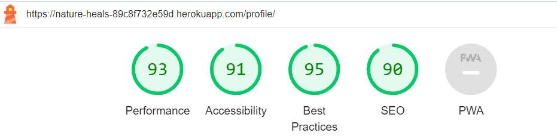
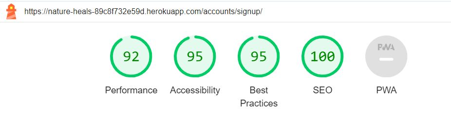

# Testing

## Automated Testing 

### CSS Validator (W3C)
 * HTML Validator 

 
     

     
Register - pass

      

     
    
    
  

      

      
Login - pass

       

      

      
 

     

     
Home - pass

      

     

    
  

      

      
Products page - pass

       

      

      
 

    

     

     
Product detail page - pass

      

    

    
  

     

     
Bag- pass

      

    

    
      

     

     
Wishlist - pass

      

     

    
  

     
      

* CSS Validator -pass

    

    
CSS Validator screenshot

     
 
    

    
  

* Javascript Validator (https://jshint.com/)

    

    
Bag -pass

     
 
    

    
 

    

    
Add product script --pass

     
 
    

    
 

    

    
Countryfields script -pass

     
 
    

    
 

    

    
Message script -pass

     
 
    

    
 

    

    
Quantity input script -pass

     
 
    

    
 

    

    
Stripe element script -pass

     
 
    

    
 

* PEP8 Validator (https://pep8ci.herokuapp.com/) -pass
        

    

    
.py files -pass

     
 
    

    
 

      The files which were tested and associated apps are listed below

      Bag app
      •	Admin.py
      •	Context.py
      •	Urls.py
      •	Views py
      •	
      Check out app
      •	Admin.py
      •	Apps
      •	Forms.py
      •	Models.py
      •	Signals
      •	Urls.py
      •	Views.py

      Home app
      •	Admin.py
      •	Apps
      •	Models.py
      •	Signals
      •	Urls.py
      •	Views.py
      Nature heals app
      •	Settings.py
      •	Urls.py

      Profiles 
      •	Admin.py
      •	Apps
      •	Forms
      •	Models.py
      •	Signals
      •	Urls.py
      • Views.py

  ### Lighthouse

  

    
Bag

     

  

  
 

   

    
Contact page

     

  

   
 

  

    
Log In

     

  

  
  

  

    
Home

     

  

  
  

  

    
My Profile

     

  

  
      

  

    
Product details

     

  

  
  

  

    
Products page

     

  

  
  

  

    
Register

     

  

  
  

  
  

    
Wishlist

     

  

  
  

## Manual testing

### Testing user stories (Real user testing)

 User 1:   Device -  Samsung Galaxy S9, Browser: Samsung Browser

 

 Navigation

 

| User stories | Feature | Expected result | Actual result |
|  :---| :---|  :---|  :---|
| 4, 5, 6 | Navbar | When I hover over account (person silhouette) icon, Wishlist icon (heart) and shopping bag icon it backgrounds changes |  Works as expected |
| 4, 5, 6 | Navbar | When I hover over All products, Herbal remedies Aromatherapy and skin care text the background changes |  Works as expected |
| 1, 6 | Navbar | When I click on Account option it shows me Login and Register link | Works as expected |
| 1,6 | Navbar  | When I click on register link it takes me to registration page   | Works as expected|
| 4 | Register page | When I click submit the form on the register page before filling any information it will give me prompt to fill in the information | Works as expected|
| 6 | Register page  | When I hover over the circle with i icon, it shows me how the password should look  | Works as expected|
| 1, 4| Register page | If two passwords don’t match, I get notified about it  | Works as expected|
|1, 4 | Register page  | When I fill in all information and click register, I receive an email to verify my email address and a message pop up to inform me about it | Works as expected|
| 1 | Login page | When I register, I am directed to login page | Works as expected|
| 1 | Register page  | When I click on login button I am directed to products page  | Works as expected|
| 5, 6 | Login   | When I enter my username and password and click login I am directed to the main page and the message appears informing me my login was successful | Works as expected|
| 2,6 | Navbar  | When I click Account and Profile, I get directed to my profile page | Works as expected|
| 3, 6, 9 | Navbar | When I click Wishlist button I am directed to My Wishlist page | Works as expected|
| 6,7 | Bag view  | When I click bag option, I am directed to Your bag page | Works as expected|
| 6,7 | All products  | When I click All Products option, I am taken to the site with All Products | Works as expected|
| 6, 7, 11| Navbar  | When I click By Price, By Size, By Category option for the products the products get sorted by Price, Size, Category respectively  | Works as expected|
| 6,7 | Navbar | When I click Herbal Remedies, Aromatherapy or Skin Care I get a list with more options| Works as expected|
| 6,7 | Products detail  | When I choose any option from Herbal Remedies, Aromatherapy or Skin Care I will get a list of products for that category | Works as expected|
| 6, 7, 9 | Products detail | When I click view product, I am directed to the page with more information about the product | Works as expected|
| 6,7 | Products detail  | When I click continue shopping, I get directed to All products page |
| 6,7 | Index page | When I click shop now or view all products button on main page it will take me to the All products page  | Works as expected|
| 1, 4, 6 | Navbar | When I click account and then logout I get logged out and message will appear | Works as expected|
| 7, 12 | Search bar | When I type a word in the search box it will select all products with the search word in it  | Works as expected|
| 6, 7 | Navbar | Admin only: When I click Account and then Add product, I get taken to the page with form to add the product  | Works as expected|
| 6, 7 | Add Product  | When I fill in the form and click Add product, the product gets added and I get notified about it with a message | Works as expected|

   

 Product viewing, searching, and selecting  

 

| User stories | Feature | Expected result | Actual result |
|  :---| :---|  :---|  :---|
| 8 | Products page  | When I open all products page, I get a list of products available | Works as expected|
| 9 | Product detail  | When I click on view product, I am taken to the product detail page and I can see more details about the product | Works as expected|
| 14 | Product detail | When the page open, I see the image and the description of the product  | Works as expected|
| 18 | Increase and Decrease functionality | I see the option to add more or take out the number of products | Works as expected|
| 18 | Increase and Decrease functionality | When I click plus button it increases the number in the quantity box by 1 | Works as expected|
| 18 | Increase and Decrease functionality | When the value in the box is higher than 99 the + button gets disabled, and I cannot click it again |  Works as expected |
| 18 | Increase and Decrease functionality  | When I click minus button, it decreases the number in the quantity box by 1 |  Works as expected |
| 18 | Increase and Decrease functionality  | When the value in the box is lower than 1 the - button gets disabled and I cannot click it again |  Works as expected |
| 4, 5, 17, 21, 22 | Increase and Decrease functionality  | When I click add to bag button, the products get added to the bag, message notification pops up and amount under bag gets updated  |  Works as expected |
| 12 | Product detail  | When I scroll down, I see Health benefits and the box with information of the product  |  Works as expected |
| 6, 14 | Product detail  |When I click on and of the options in the box on the right such as ‘Ingredients', 'Herbal Components’, ‘Vitamins and Minerals', it opens and shows more text | Works as expected|
| 13 | Review functionality   | When I scroll down, I see Reviews if there are any entered | Works as expected|
| 15 | Review functionality   | When I write review in the box on the right and click Add review, the review appears in the list on the right | Works as expected|
| 4, 15, 36 | Review functionality   | When logged out and I try to add a review, it shows me the message prompting me to log in to add the review | Works as expected|
| 13, 15, 16 | Review functionality   | When I click on edit review of the existing review created by me I window pops up where I can edit my review.  | Works as expected|
| 13, 15, 16 | Review functionality   | When I write a review in the window and click edit review the review gets updated | Works as expected|
| 4, 15, 16 | Review functionality   | When I update the review, I get notified about it in the message box  | Works as expected|
| 4, 17 | Delete functionality  | When I click on the red cross, I window pops up asking me to confirm that I want to delete the review | Works as expected|
| 4, 17| Delete functionality  | Delete functionality | Works as expected|
| 4, 17 | Delete functionality  | When I click delete button, the review gets deleted | Works as expected|
| 6 | Products detail  |When I click on the continue shopping it takes me back to the product page | Works as expected|
| 4, 10 | Add to Wishlist functionality | When logged out and I click on empty heart icon on any product image, a message will pop out informing me that only logged in users can do that | Works as expected|
| 4, 10 | Add to Wishlist functionality | When logged in and I click on empty heart icon on any product image it will add the product to the Wishlist, and the heart gets filled with green colour| Works as expected|
| 4, 18 | Delete from Wishlist functionality | When I click on a filled in heart icon of the product, I have already selected it will remove the item from my Wishlist  | Works as expected|
| 9 | Wishlist | When I click on the Wishlist option (heart icon) in the main navigation bar, it will take me to my Wishlist, and I can view all the items | Works as expected|
| 19 | Delete from Wishlist functionality | When I click on the filled heart icon of the products in my Wishlist, the item gets removed  | Works as expected|
| 4, 36 | Navbar | When logged out and I click Wishlist, it gives me an error message prompting me to log in to view my Wishlist  | Works as expected|

 

 Purchasing products and checkout

 
 
| User stories | Feature | Expected result | Actual result |
|  :---| :---|  :---|  :---|
| 6, 20, 21,23 | Navbar | When I click on bag button, I get directed to my  bagview  |  Works as expected |
| 32 | Navbar  | When logged out and I click on bag icon, it will still direct me to my bag |  Works as expected |
| 4, 6, 22  | Increase and Decrease functionality | When I click plus button, the number in the quantity box increases by 1 and a message notifying me about these pops up in the right corner |  Works as expected |
| 22 | Increase and Decrease functionality | When the value in the box is higher than 99 the + button gets disabled, and I cannot click it again  |  Works as expected |
| 4, 6, 22| Increase and Decrease functionality | When I click minus button the number in the quantity box decreases by 1 and a message notifying me about these pops up in the right corner |  Works as expected |
| 22 | Increase and Decrease functionality | When the value in the box is lower than 1 the minus button gets disabled, and I cannot click it again |  Works as expected |
| 6 | Checkout | When I click secure checkout, I am taken to the checkout page |  Works as expected |
| 4, 30 | Checkout | When I click on secure checkout without filing the form, I get prompted to fill the missing fields |  Works as expected |
| 6, 27 | Checkout   | When I fill in the form and choose to save the delivery box, the details get saved and I see them next time I want to do the purchase |  Works as expected |
| 4, 30 | Checkout   | When I enter the wrong card details, I get the notification telling me that my card number is invalid |  Works as expected |
| 4, 21 | Checkout  | The message showing the total amount that will be taken from my card shows correct amount  |  Works as expected |
| 25 | Checkout | If my shopping doesn’t go over a certain amount, the message is displayed in summary as well as under the list of items in shopping bag showing how much I still need to spend to be eligible for free delivery |  Works as expected |
| 46 | Checkout  |When I click complete order button, the pages loads, and I am not able to click anything  |  Works as expected |
| 4, 6 | Checkout-success  | Once I complete the order, I get the message saying, 'Thank you' and I can see the order summary |  Works as expected |
| 29, 30 | Email confirmation  |Once I complete the order, I get confirmation email to my email address |  Works as expected |
| 24, 5, 29, 34 | Profile page  | On my profile page, I can see my past orders and saved billing details  |  Works as expected |
| 25, 40 | Profile page  | When I update my billing details and click 'Update my details' button, my details get updated |  Works as expected |
| 24 | Profile page | When I click on order number in order history, I can see the previous order details  |  Works as expected |

 

 Product management (admin only)

 

| User stories | Feature | Expected result | Actual result |
|  :---| :---|  :---|  :---|
| 6 , 9  | Add Product  | I can click on add product which takes me to the add product page |  Works as expected |
| 31 | Add Product Form | When I fill in the information and click add product, the product gets added and I can see it on the main page |  Works as expected |
| 32 | Edit product functionality | I can click on edit button on the product page  and edit the product |  Works as expected |
| 32 | Delete product functionality |When I click on delete button on the product page, a modal appears asking me to confirm my choice |  Works as expected |
| 32 | Delete product functionality | When I click on delete button on the modal, the product gets deleted |  Works as expected |

 User’s activity management (admin only)

 

| User stories | Feature | Expected result | Actual result |
|  :---| :---|  :---|  :---|
| 35 | Edit review functionality | When I click on edit review button, a modal pop up which enables me to edit review  |  Works as expected |
| 35 | Edit review functionality  | When I write a review in edit box and click edit review the original review gets overridden  | Works as expected |
| 36 | Delete button functionality  | When I click on red cross under the review a modal appears asking me to confirm that I want to delete the review |  Works as expected |
| 35 | Delete button functionality  | When click on delete button the review gets deleted |  Works as expected |

 

 

 User 2: Device - iPhone 13 mini, Browser: Safari

 

 Navigation

 

| User stories | Feature | Expected result | Actual result |
|  :---| :---|  :---|  :---|
| 4, 5, 6 | Navbar | When I hover over account (person silhouette) icon, Wishlist icon (heart) and shopping bag icon it backgrounds changes |  Works as expected |
| 4, 5, 6 | Navbar | When I hover over All products, Herbal remedies Aromatherapy and skin care text the background changes |  Works as expected |
| 1, 6 | Navbar | When I click on Account option it shows me Login and Register link | Works as expected |
| 1,6 | Navbar  | When I click on register link it takes me to registration page   | Works as expected|
| 4 | Register page | When I click submit the form on the register page before filling any information it will give me prompt to fill in the information | Works as expected|
| 6 | Register page  | When I hover over the circle with i icon, it shows me how the password should look  | Works as expected|
| 1, 4| Register page | If two passwords don’t match, I get notified about it  | Works as expected|
|1, 4 | Register page  | When I fill in all information and click register, I receive an email to verify my email address and a message pop up to inform me about it | Works as expected|
| 1 | Login page | When I register, I am directed to login page | Works as expected|
| 1 | Register page  | When I click on login button I am directed to products page  | Works as expected|
| 5, 6 | Login   | When I enter my username and password and click login I am directed to the main page and the message appears informing me my login was successful | Works as expected|
| 2,6 | Navbar  | When I click Account and Profile, I get directed to my profile page | Works as expected|
| 3, 6, 9 | Navbar | When I click Wishlist button I am directed to My Wishlist page | Works as expected|
| 6,7 | Bag view  | When I click bag option, I am directed to Your bag page | Works as expected|
| 6,7 | All products  | When I click All Products option, I am taken to the site with All Products | Works as expected|
| 6, 7, 11| Navbar  | When I click By Price, By Size, By Category option for the products the products get sorted by Price, Size, Category respectively  | Works as expected|
| 6,7 | Navbar | When I click Herbal Remedies, Aromatherapy or Skin Care I get a list with more options| Works as expected|
| 6,7 | Products detail  | When I choose any option from Herbal Remedies, Aromatherapy or Skin Care I will get a list of products for that category | Works as expected|
| 6, 7, 9 | Products detail | When I click view product, I am directed to the page with more information about the product | Works as expected|
| 6,7 | Products detail  | When I click continue shopping, I get directed to All products page |
| 6,7 | Index page | When I click shop now or view all products button on main page it will take me to the All products page  | Works as expected|
| 1, 4, 6 | Navbar | When I click account and then logout I get logged out and message will appear | Works as expected|
| 7, 12 | Search bar | When I type a word in the search box it will select all products with the search word in it  | Works as expected|
| 6, 7 | Navbar | Admin only: When I click Account and then Add product, I get taken to the page with form to add the product  | Works as expected|
| 6, 7 | Add Product  | When I fill in the form and click Add product, the product gets added and I get notified about it with a message | Works as expected|

   

 Product viewing, searching, and selecting  

 

| User stories | Feature | Expected result | Actual result |
|  :---| :---|  :---|  :---|
| 8 | Products page  | When I open all products page, I get a list of products available | Works as expected|
| 9 | Product detail  | When I click on view product, I am taken to the product detail page and I can see more details about the product | Works as expected|
| 14 | Product detail | When the page open, I see the image and the description of the product  | Works as expected|
| 18 | Increase and Decrease functionality | I see the option to add more or take out the number of products | Works as expected|
| 18 | Increase and Decrease functionality | When I click plus button it increases the number in the quantity box by 1 | Works as expected|
| 18 | Increase and Decrease functionality | When the value in the box is higher than 99 the + button gets disabled, and I cannot click it again |  Works as expected |
| 18 | Increase and Decrease functionality  | When I click minus button, it decreases the number in the quantity box by 1 |  Works as expected |
| 18 | Increase and Decrease functionality  | When the value in the box is lower than 1 the - button gets disabled and I cannot click it again |  Works as expected |
| 4, 5, 17, 21, 22 | Increase and Decrease functionality  | When I click add to bag button, the products get added to the bag, message notification pops up and amount under bag gets updated  |  Works as expected |
| 12 | Product detail  | When I scroll down, I see Health benefits and the box with information of the product  |  Works as expected |
| 6, 14 | Product detail  |When I click on and of the options in the box on the right such as ‘Ingredients', 'Herbal Components’, ‘Vitamins and Minerals', it opens and shows more text | Works as expected|
| 13 | Review functionality   | When I scroll down, I see Reviews if there are any entered | Works as expected|
| 15 | Review functionality   | When I write review in the box on the right and click Add review, the review appears in the list on the right | Works as expected|
| 4, 15, 36 | Review functionality   | When logged out and I try to add a review, it shows me the message prompting me to log in to add the review | Works as expected|
| 13, 15, 16 | Review functionality   | When I click on edit review of the existing review created by me I window pops up where I can edit my review.  | Works as expected|
| 13, 15, 16 | Review functionality   | When I write a review in the window and click edit review the review gets updated | Works as expected|
| 4, 15, 16 | Review functionality   | When I update the review, I get notified about it in the message box  | Works as expected|
| 4, 17 | Delete functionality  | When I click on the red cross, I window pops up asking me to confirm that I want to delete the review | Works as expected|
| 4, 17| Delete functionality  | Delete functionality | Works as expected|
| 4, 17 | Delete functionality  | When I click delete button, the review gets deleted | Works as expected|
| 6 | Products detail  |When I click on the continue shopping it takes me back to the product page | Works as expected|
| 4, 10 | Add to Wishlist functionality | When logged out and I click on empty heart icon on any product image, a message will pop out informing me that only logged in users can do that | Works as expected|
| 4, 10 | Add to Wishlist functionality | When logged in and I click on empty heart icon on any product image it will add the product to the Wishlist, and the heart gets filled with green colour| Works as expected|
| 4, 18 | Delete from Wishlist functionality | When I click on a filled in heart icon of the product, I have already selected it will remove the item from my Wishlist  | Works as expected|
| 9 | Wishlist | When I click on the Wishlist option (heart icon) in the main navigation bar, it will take me to my Wishlist, and I can view all the items | Works as expected|
| 19 | Delete from Wishlist functionality | When I click on the filled heart icon of the products in my Wishlist, the item gets removed  | Works as expected|
| 4, 36 | Navbar | When logged out and I click Wishlist, it gives me an error message prompting me to log in to view my Wishlist  | Works as expected|

 

 Purchasing products and checkout

 
 
| User stories | Feature | Expected result | Actual result |
|  :---| :---|  :---|  :---|
| 6, 20, 21,23 | Navbar | When I click on bag button, I get directed to my  bagview  |  Works as expected |
| 32 | Navbar  | When logged out and I click on bag icon, it will still direct me to my bag |  Works as expected |
| 4, 6, 22  | Increase and Decrease functionality | When I click plus button, the number in the quantity box increases by 1 and a message notifying me about these pops up in the right corner |  Works as expected |
| 22 | Increase and Decrease functionality | When the value in the box is higher than 99 the + button gets disabled, and I cannot click it again  |  Works as expected |
| 4, 6, 22| Increase and Decrease functionality | When I click minus button the number in the quantity box decreases by 1 and a message notifying me about these pops up in the right corner |  Works as expected |
| 22 | Increase and Decrease functionality | When the value in the box is lower than 1 the minus button gets disabled, and I cannot click it again |  Works as expected |
| 6 | Checkout | When I click secure checkout, I am taken to the checkout page |  Works as expected |
| 4, 30 | Checkout | When I click on secure checkout without filing the form, I get prompted to fill the missing fields |  Works as expected |
| 6, 27 | Checkout   | When I fill in the form and choose to save the delivery box, the details get saved and I see them next time I want to do the purchase |  Works as expected |
| 4, 30 | Checkout   | When I enter the wrong card details, I get the notification telling me that my card number is invalid |  Works as expected |
| 4, 21 | Checkout  | The message showing the total amount that will be taken from my card shows correct amount  |  Works as expected |
| 25 | Checkout | If my shopping doesn’t go over a certain amount, the message is displayed in summary as well as under the list of items in shopping bag showing how much I still need to spend to be eligible for free delivery |  Works as expected |
| 46 | Checkout  |When I click complete order button, the pages loads, and I am not able to click anything  |  Works as expected |
| 4, 6 | Checkout-success  | Once I complete the order, I get the message saying, 'Thank you' and I can see the order summary |  Works as expected |
| 29, 30 | Email confirmation  |Once I complete the order, I get confirmation email to my email address |  Works as expected |
| 24, 5, 29, 34 | Profile page  | On my profile page, I can see my past orders and saved billing details  |  Works as expected |
| 25, 40 | Profile page  | When I update my billing details and click 'Update my details' button, my details get updated |  Works as expected |
| 24 | Profile page | When I click on order number in order history, I can see the previous order details  |  Works as expected |

 

 Product management (admin only)

 

| User stories | Feature | Expected result | Actual result |
|  :---| :---|  :---|  :---|
| 6 , 9  | Add Product  | I can click on add product which takes me to the add product page |  Works as expected |
| 31 | Add Product Form | When I fill in the information and click add product, the product gets added and I can see it on the main page |  Works as expected |
| 32 | Edit product functionality | I can click on edit button on the product page  and edit the product |  Works as expected |
| 32 | Delete product functionality |When I click on delete button on the product page, a modal appears asking me to confirm my choice |  Works as expected |
| 32 | Delete product functionality | When I click on delete button on the modal, the product gets deleted |  Works as expected |

 User’s activity management (admin only)

 

| User stories | Feature | Expected result | Actual result |
|  :---| :---|  :---|  :---|
| 35 | Edit review functionality | When I click on edit review button, a modal pop up which enables me to edit review  |  Works as expected |
| 35 | Edit review functionality  | When I write a review in edit box and click edit review the original review gets overridden  | Works as expected |
| 36 | Delete button functionality  | When I click on red cross under the review a modal appears asking me to confirm that I want to delete the review |  Works as expected |
| 35 | Delete button functionality  | When click on delete button the review gets deleted |  Works as expected |

 

 

 User 3: Device - Apple iPad mini, Browser: Safari

 

 Navigation

 

| User stories | Feature | Expected result | Actual result |
|  :---| :---|  :---|  :---|
| 4, 5, 6 | Navbar | When I hover over account (person silhouette) icon, Wishlist icon (heart) and shopping bag icon it backgrounds changes |  Works as expected |
| 4, 5, 6 | Navbar | When I hover over All products, Herbal remedies Aromatherapy and skin care text the background changes |  Works as expected |
| 1, 6 | Navbar | When I click on Account option it shows me Login and Register link | Works as expected |
| 1,6 | Navbar  | When I click on register link it takes me to registration page   | Works as expected|
| 4 | Register page | When I click submit the form on the register page before filling any information it will give me prompt to fill in the information | Works as expected|
| 6 | Register page  | When I hover over the circle with i icon, it shows me how the password should look  | Works as expected|
| 1, 4| Register page | If two passwords don’t match, I get notified about it  | Works as expected|
|1, 4 | Register page  | When I fill in all information and click register, I receive an email to verify my email address and a message pop up to inform me about it | Works as expected|
| 1 | Login page | When I register, I am directed to login page | Works as expected|
| 1 | Register page  | When I click on login button I am directed to products page  | Works as expected|
| 5, 6 | Login   | When I enter my username and password and click login I am directed to the main page and the message appears informing me my login was successful | Works as expected|
| 2,6 | Navbar  | When I click Account and Profile, I get directed to my profile page | Works as expected|
| 3, 6, 9 | Navbar | When I click Wishlist button I am directed to My Wishlist page | Works as expected|
| 6,7 | Bag view  | When I click bag option, I am directed to Your bag page | Works as expected|
| 6,7 | All products  | When I click All Products option, I am taken to the site with All Products | Works as expected|
| 6, 7, 11| Navbar  | When I click By Price, By Size, By Category option for the products the products get sorted by Price, Size, Category respectively  | Works as expected|
| 6,7 | Navbar | When I click Herbal Remedies, Aromatherapy or Skin Care I get a list with more options| Works as expected|
| 6,7 | Products detail  | When I choose any option from Herbal Remedies, Aromatherapy or Skin Care I will get a list of products for that category | Works as expected|
| 6, 7, 9 | Products detail | When I click view product, I am directed to the page with more information about the product | Works as expected|
| 6,7 | Products detail  | When I click continue shopping, I get directed to All products page |
| 6,7 | Index page | When I click shop now or view all products button on main page it will take me to the All products page  | Works as expected|
| 1, 4, 6 | Navbar | When I click account and then logout I get logged out and message will appear | Works as expected|
| 7, 12 | Search bar | When I type a word in the search box it will select all products with the search word in it  | Works as expected|
| 6, 7 | Navbar | Admin only: When I click Account and then Add product, I get taken to the page with form to add the product  | Works as expected|
| 6, 7 | Add Product  | When I fill in the form and click Add product, the product gets added and I get notified about it with a message | Works as expected|

   

 Product viewing, searching, and selecting  

 

| User stories | Feature | Expected result | Actual result |
|  :---| :---|  :---|  :---|
| 8 | Products page  | When I open all products page, I get a list of products available | Works as expected|
| 9 | Product detail  | When I click on view product, I am taken to the product detail page and I can see more details about the product | Works as expected|
| 14 | Product detail | When the page open, I see the image and the description of the product  | Works as expected|
| 18 | Increase and Decrease functionality | I see the option to add more or take out the number of products | Works as expected|
| 18 | Increase and Decrease functionality | When I click plus button it increases the number in the quantity box by 1 | Works as expected|
| 18 | Increase and Decrease functionality | When the value in the box is higher than 99 the + button gets disabled, and I cannot click it again |  Works as expected |
| 18 | Increase and Decrease functionality  | When I click minus button, it decreases the number in the quantity box by 1 |  Works as expected |
| 18 | Increase and Decrease functionality  | When the value in the box is lower than 1 the - button gets disabled and I cannot click it again |  Works as expected |
| 4, 5, 17, 21, 22 | Increase and Decrease functionality  | When I click add to bag button, the products get added to the bag, message notification pops up and amount under bag gets updated  |  Works as expected |
| 12 | Product detail  | When I scroll down, I see Health benefits and the box with information of the product  |  Works as expected |
| 6, 14 | Product detail  |When I click on and of the options in the box on the right such as ‘Ingredients', 'Herbal Components’, ‘Vitamins and Minerals', it opens and shows more text | Works as expected|
| 13 | Review functionality   | When I scroll down, I see Reviews if there are any entered | Works as expected|
| 15 | Review functionality   | When I write review in the box on the right and click Add review, the review appears in the list on the right | Works as expected|
| 4, 15, 36 | Review functionality   | When logged out and I try to add a review, it shows me the message prompting me to log in to add the review | Works as expected|
| 13, 15, 16 | Review functionality   | When I click on edit review of the existing review created by me I window pops up where I can edit my review.  | Works as expected|
| 13, 15, 16 | Review functionality   | When I write a review in the window and click edit review the review gets updated | Works as expected|
| 4, 15, 16 | Review functionality   | When I update the review, I get notified about it in the message box  | Works as expected|
| 4, 17 | Delete functionality  | When I click on the red cross, I window pops up asking me to confirm that I want to delete the review | Works as expected|
| 4, 17| Delete functionality  | Delete functionality | Works as expected|
| 4, 17 | Delete functionality  | When I click delete button, the review gets deleted | Works as expected|
| 6 | Products detail  |When I click on the continue shopping it takes me back to the product page | Works as expected|
| 4, 10 | Add to Wishlist functionality | When logged out and I click on empty heart icon on any product image, a message will pop out informing me that only logged in users can do that | Works as expected|
| 4, 10 | Add to Wishlist functionality | When logged in and I click on empty heart icon on any product image it will add the product to the Wishlist, and the heart gets filled with green colour| Works as expected|
| 4, 18 | Delete from Wishlist functionality | When I click on a filled in heart icon of the product, I have already selected it will remove the item from my Wishlist  | Works as expected|
| 9 | Wishlist | When I click on the Wishlist option (heart icon) in the main navigation bar, it will take me to my Wishlist, and I can view all the items | Works as expected|
| 19 | Delete from Wishlist functionality | When I click on the filled heart icon of the products in my Wishlist, the item gets removed  | Works as expected|
| 4, 36 | Navbar | When logged out and I click Wishlist, it gives me an error message prompting me to log in to view my Wishlist  | Works as expected|

 

 Purchasing products and checkout

 
 
| User stories | Feature | Expected result | Actual result |
|  :---| :---|  :---|  :---|
| 6, 20, 21,23 | Navbar | When I click on bag button, I get directed to my  bagview  |  Works as expected |
| 32 | Navbar  | When logged out and I click on bag icon, it will still direct me to my bag |  Works as expected |
| 4, 6, 22  | Increase and Decrease functionality | When I click plus button, the number in the quantity box increases by 1 and a message notifying me about these pops up in the right corner |  Works as expected |
| 22 | Increase and Decrease functionality | When the value in the box is higher than 99 the + button gets disabled, and I cannot click it again  |  Works as expected |
| 4, 6, 22| Increase and Decrease functionality | When I click minus button the number in the quantity box decreases by 1 and a message notifying me about these pops up in the right corner |  Works as expected |
| 22 | Increase and Decrease functionality | When the value in the box is lower than 1 the minus button gets disabled, and I cannot click it again |  Works as expected |
| 6 | Checkout | When I click secure checkout, I am taken to the checkout page |  Works as expected |
| 4, 30 | Checkout | When I click on secure checkout without filing the form, I get prompted to fill the missing fields |  Works as expected |
| 6, 27 | Checkout   | When I fill in the form and choose to save the delivery box, the details get saved and I see them next time I want to do the purchase |  Works as expected |
| 4, 30 | Checkout   | When I enter the wrong card details, I get the notification telling me that my card number is invalid |  Works as expected |
| 4, 21 | Checkout  | The message showing the total amount that will be taken from my card shows correct amount  |  Works as expected |
| 25 | Checkout | If my shopping doesn’t go over a certain amount, the message is displayed in summary as well as under the list of items in shopping bag showing how much I still need to spend to be eligible for free delivery |  Works as expected |
| 46 | Checkout  |When I click complete order button, the pages loads, and I am not able to click anything  |  Works as expected |
| 4, 6 | Checkout-success  | Once I complete the order, I get the message saying, 'Thank you' and I can see the order summary |  Works as expected |
| 29, 30 | Email confirmation  |Once I complete the order, I get confirmation email to my email address |  Works as expected |
| 24, 5, 29, 34 | Profile page  | On my profile page, I can see my past orders and saved billing details  |  Works as expected |
| 25, 40 | Profile page  | When I update my billing details and click 'Update my details' button, my details get updated |  Works as expected |
| 24 | Profile page | When I click on order number in order history, I can see the previous order details  |  Works as expected |

 

 Product management (admin only)

 

| User stories | Feature | Expected result | Actual result |
|  :---| :---|  :---|  :---|
| 6 , 9  | Add Product  | I can click on add product which takes me to the add product page |  Works as expected |
| 31 | Add Product Form | When I fill in the information and click add product, the product gets added and I can see it on the main page |  Works as expected |
| 32 | Edit product functionality | I can click on edit button on the product page  and edit the product |  Works as expected |
| 32 | Delete product functionality |When I click on delete button on the product page, a modal appears asking me to confirm my choice |  Works as expected |
| 32 | Delete product functionality | When I click on delete button on the modal, the product gets deleted |  Works as expected |

 User’s activity management (admin only)

 

| User stories | Feature | Expected result | Actual result |
|  :---| :---|  :---|  :---|
| 35 | Edit review functionality | When I click on edit review button, a modal pop up which enables me to edit review  |  Works as expected |
| 35 | Edit review functionality  | When I write a review in edit box and click edit review the original review gets overridden  | Works as expected |
| 36 | Delete button functionality  | When I click on red cross under the review a modal appears asking me to confirm that I want to delete the review |  Works as expected |
| 35 | Delete button functionality  | When click on delete button the review gets deleted |  Works as expected |

 

 

 User 4: Device - Samsung Galaxy Tab A8, Browser: Samsung browser

 

 Navigation

 

| User stories | Feature | Expected result | Actual result |
|  :---| :---|  :---|  :---|
| 4, 5, 6 | Navbar | When I hover over account (person silhouette) icon, Wishlist icon (heart) and shopping bag icon it backgrounds changes |  Works as expected |
| 4, 5, 6 | Navbar | When I hover over All products, Herbal remedies Aromatherapy and skin care text the background changes |  Works as expected |
| 1, 6 | Navbar | When I click on Account option it shows me Login and Register link | Works as expected |
| 1,6 | Navbar  | When I click on register link it takes me to registration page   | Works as expected|
| 4 | Register page | When I click submit the form on the register page before filling any information it will give me prompt to fill in the information | Works as expected|
| 6 | Register page  | When I hover over the circle with i icon, it shows me how the password should look  | Works as expected|
| 1, 4| Register page | If two passwords don’t match, I get notified about it  | Works as expected|
|1, 4 | Register page  | When I fill in all information and click register, I receive an email to verify my email address and a message pop up to inform me about it | Works as expected|
| 1 | Login page | When I register, I am directed to login page | Works as expected|
| 1 | Register page  | When I click on login button I am directed to products page  | Works as expected|
| 5, 6 | Login   | When I enter my username and password and click login I am directed to the main page and the message appears informing me my login was successful | Works as expected|
| 2,6 | Navbar  | When I click Account and Profile, I get directed to my profile page | Works as expected|
| 3, 6, 9 | Navbar | When I click Wishlist button I am directed to My Wishlist page | Works as expected|
| 6,7 | Bag view  | When I click bag option, I am directed to Your bag page | Works as expected|
| 6,7 | All products  | When I click All Products option, I am taken to the site with All Products | Works as expected|
| 6, 7, 11| Navbar  | When I click By Price, By Size, By Category option for the products the products get sorted by Price, Size, Category respectively  | Works as expected|
| 6,7 | Navbar | When I click Herbal Remedies, Aromatherapy or Skin Care I get a list with more options| Works as expected|
| 6,7 | Products detail  | When I choose any option from Herbal Remedies, Aromatherapy or Skin Care I will get a list of products for that category | Works as expected|
| 6, 7, 9 | Products detail | When I click view product, I am directed to the page with more information about the product | Works as expected|
| 6,7 | Products detail  | When I click continue shopping, I get directed to All products page |
| 6,7 | Index page | When I click shop now or view all products button on main page it will take me to the All products page  | Works as expected|
| 1, 4, 6 | Navbar | When I click account and then logout I get logged out and message will appear | Works as expected|
| 7, 12 | Search bar | When I type a word in the search box it will select all products with the search word in it  | Works as expected|
| 6, 7 | Navbar | Admin only: When I click Account and then Add product, I get taken to the page with form to add the product  | Works as expected|
| 6, 7 | Add Product  | When I fill in the form and click Add product, the product gets added and I get notified about it with a message | Works as expected|

   

 Product viewing, searching, and selecting  

 

| User stories | Feature | Expected result | Actual result |
|  :---| :---|  :---|  :---|
| 8 | Products page  | When I open all products page, I get a list of products available | Works as expected|
| 9 | Product detail  | When I click on view product, I am taken to the product detail page and I can see more details about the product | Works as expected|
| 14 | Product detail | When the page open, I see the image and the description of the product  | Works as expected|
| 18 | Increase and Decrease functionality | I see the option to add more or take out the number of products | Works as expected|
| 18 | Increase and Decrease functionality | When I click plus button it increases the number in the quantity box by 1 | Works as expected|
| 18 | Increase and Decrease functionality | When the value in the box is higher than 99 the + button gets disabled, and I cannot click it again |  Works as expected |
| 18 | Increase and Decrease functionality  | When I click minus button, it decreases the number in the quantity box by 1 |  Works as expected |
| 18 | Increase and Decrease functionality  | When the value in the box is lower than 1 the - button gets disabled and I cannot click it again |  Works as expected |
| 4, 5, 17, 21, 22 | Increase and Decrease functionality  | When I click add to bag button, the products get added to the bag, message notification pops up and amount under bag gets updated  |  Works as expected |
| 12 | Product detail  | When I scroll down, I see Health benefits and the box with information of the product  |  Works as expected |
| 6, 14 | Product detail  |When I click on and of the options in the box on the right such as ‘Ingredients', 'Herbal Components’, ‘Vitamins and Minerals', it opens and shows more text | Works as expected|
| 13 | Review functionality   | When I scroll down, I see Reviews if there are any entered | Works as expected|
| 15 | Review functionality   | When I write review in the box on the right and click Add review, the review appears in the list on the right | Works as expected|
| 4, 15, 36 | Review functionality   | When logged out and I try to add a review, it shows me the message prompting me to log in to add the review | Works as expected|
| 13, 15, 16 | Review functionality   | When I click on edit review of the existing review created by me I window pops up where I can edit my review.  | Works as expected|
| 13, 15, 16 | Review functionality   | When I write a review in the window and click edit review the review gets updated | Works as expected|
| 4, 15, 16 | Review functionality   | When I update the review, I get notified about it in the message box  | Works as expected|
| 4, 17 | Delete functionality  | When I click on the red cross, I window pops up asking me to confirm that I want to delete the review | Works as expected|
| 4, 17| Delete functionality  | Delete functionality | Works as expected|
| 4, 17 | Delete functionality  | When I click delete button, the review gets deleted | Works as expected|
| 6 | Products detail  |When I click on the continue shopping it takes me back to the product page | Works as expected|
| 4, 10 | Add to Wishlist functionality | When logged out and I click on empty heart icon on any product image, a message will pop out informing me that only logged in users can do that | Works as expected|
| 4, 10 | Add to Wishlist functionality | When logged in and I click on empty heart icon on any product image it will add the product to the Wishlist, and the heart gets filled with green colour| Works as expected|
| 4, 18 | Delete from Wishlist functionality | When I click on a filled in heart icon of the product, I have already selected it will remove the item from my Wishlist  | Works as expected|
| 9 | Wishlist | When I click on the Wishlist option (heart icon) in the main navigation bar, it will take me to my Wishlist, and I can view all the items | Works as expected|
| 19 | Delete from Wishlist functionality | When I click on the filled heart icon of the products in my Wishlist, the item gets removed  | Works as expected|
| 4, 36 | Navbar | When logged out and I click Wishlist, it gives me an error message prompting me to log in to view my Wishlist  | Works as expected|

 

 Purchasing products and checkout

 
 
| User stories | Feature | Expected result | Actual result |
|  :---| :---|  :---|  :---|
| 6, 20, 21,23 | Navbar | When I click on bag button, I get directed to my  bagview  |  Works as expected |
| 32 | Navbar  | When logged out and I click on bag icon, it will still direct me to my bag |  Works as expected |
| 4, 6, 22  | Increase and Decrease functionality | When I click plus button, the number in the quantity box increases by 1 and a message notifying me about these pops up in the right corner |  Works as expected |
| 22 | Increase and Decrease functionality | When the value in the box is higher than 99 the + button gets disabled, and I cannot click it again  |  Works as expected |
| 4, 6, 22| Increase and Decrease functionality | When I click minus button the number in the quantity box decreases by 1 and a message notifying me about these pops up in the right corner |  Works as expected |
| 22 | Increase and Decrease functionality | When the value in the box is lower than 1 the minus button gets disabled, and I cannot click it again |  Works as expected |
| 6 | Checkout | When I click secure checkout, I am taken to the checkout page |  Works as expected |
| 4, 30 | Checkout | When I click on secure checkout without filing the form, I get prompted to fill the missing fields |  Works as expected |
| 6, 27 | Checkout   | When I fill in the form and choose to save the delivery box, the details get saved and I see them next time I want to do the purchase |  Works as expected |
| 4, 30 | Checkout   | When I enter the wrong card details, I get the notification telling me that my card number is invalid |  Works as expected |
| 4, 21 | Checkout  | The message showing the total amount that will be taken from my card shows correct amount  |  Works as expected |
| 25 | Checkout | If my shopping doesn’t go over a certain amount, the message is displayed in summary as well as under the list of items in shopping bag showing how much I still need to spend to be eligible for free delivery |  Works as expected |
| 46 | Checkout  |When I click complete order button, the pages loads, and I am not able to click anything  |  Works as expected |
| 4, 6 | Checkout-success  | Once I complete the order, I get the message saying, 'Thank you' and I can see the order summary |  Works as expected |
| 29, 30 | Email confirmation  |Once I complete the order, I get confirmation email to my email address |  Works as expected |
| 24, 5, 29, 34 | Profile page  | On my profile page, I can see my past orders and saved billing details  |  Works as expected |
| 25, 40 | Profile page  | When I update my billing details and click 'Update my details' button, my details get updated |  Works as expected |
| 24 | Profile page | When I click on order number in order history, I can see the previous order details  |  Works as expected |

 

 Product management (admin only)

 

| User stories | Feature | Expected result | Actual result |
|  :---| :---|  :---|  :---|
| 6 , 9  | Add Product  | I can click on add product which takes me to the add product page |  Works as expected |
| 31 | Add Product Form | When I fill in the information and click add product, the product gets added and I can see it on the main page |  Works as expected |
| 32 | Edit product functionality | I can click on edit button on the product page  and edit the product |  Works as expected |
| 32 | Delete product functionality |When I click on delete button on the product page, a modal appears asking me to confirm my choice |  Works as expected |
| 32 | Delete product functionality | When I click on delete button on the modal, the product gets deleted |  Works as expected |

 User’s activity management (admin only)

 

| User stories | Feature | Expected result | Actual result |
|  :---| :---|  :---|  :---|
| 35 | Edit review functionality | When I click on edit review button, a modal pop up which enables me to edit review  |  Works as expected |
| 35 | Edit review functionality  | When I write a review in edit box and click edit review the original review gets overridden  | Works as expected |
| 36 | Delete button functionality  | When I click on red cross under the review a modal appears asking me to confirm that I want to delete the review |  Works as expected |
| 35 | Delete button functionality  | When click on delete button the review gets deleted |  Works as expected |

 

 

 User 5: Device - Laptop: Lenovo ThinkPad P14S, Browser: Chrome, Microsoft Edge, Microsoft Explorer

 

 Navigation

 

| User stories | Feature | Expected result | Actual result |
|  :---| :---|  :---|  :---|
| 4, 5, 6 | Navbar | When I hover over account (person silhouette) icon, Wishlist icon (heart) and shopping bag icon it backgrounds changes |  Works as expected |
| 4, 5, 6 | Navbar | When I hover over All products, Herbal remedies Aromatherapy and skin care text the background changes |  Works as expected |
| 1, 6 | Navbar | When I click on Account option it shows me Login and Register link | Works as expected |
| 1,6 | Navbar  | When I click on register link it takes me to registration page   | Works as expected|
| 4 | Register page | When I click submit the form on the register page before filling any information it will give me prompt to fill in the information | Works as expected|
| 6 | Register page  | When I hover over the circle with i icon, it shows me how the password should look  | Works as expected|
| 1, 4| Register page | If two passwords don’t match, I get notified about it  | Works as expected|
|1, 4 | Register page  | When I fill in all information and click register, I receive an email to verify my email address and a message pop up to inform me about it | Works as expected|
| 1 | Login page | When I register, I am directed to login page | Works as expected|
| 1 | Register page  | When I click on login button I am directed to products page  | Works as expected|
| 5, 6 | Login   | When I enter my username and password and click login I am directed to the main page and the message appears informing me my login was successful | Works as expected|
| 2,6 | Navbar  | When I click Account and Profile, I get directed to my profile page | Works as expected|
| 3, 6, 9 | Navbar | When I click Wishlist button I am directed to My Wishlist page | Works as expected|
| 6,7 | Bag view  | When I click bag option, I am directed to Your bag page | Works as expected|
| 6,7 | All products  | When I click All Products option, I am taken to the site with All Products | Works as expected|
| 6, 7, 11| Navbar  | When I click By Price, By Size, By Category option for the products the products get sorted by Price, Size, Category respectively  | Works as expected|
| 6,7 | Navbar | When I click Herbal Remedies, Aromatherapy or Skin Care I get a list with more options| Works as expected|
| 6,7 | Products detail  | When I choose any option from Herbal Remedies, Aromatherapy or Skin Care I will get a list of products for that category | Works as expected|
| 6, 7, 9 | Products detail | When I click view product, I am directed to the page with more information about the product | Works as expected|
| 6,7 | Products detail  | When I click continue shopping, I get directed to All products page |
| 6,7 | Index page | When I click shop now or view all products button on main page it will take me to the All products page  | Works as expected|
| 1, 4, 6 | Navbar | When I click account and then logout I get logged out and message will appear | Works as expected|
| 7, 12 | Search bar | When I type a word in the search box it will select all products with the search word in it  | Works as expected|
| 6, 7 | Navbar | Admin only: When I click Account and then Add product, I get taken to the page with form to add the product  | Works as expected|
| 6, 7 | Add Product  | When I fill in the form and click Add product, the product gets added and I get notified about it with a message | Works as expected|

   

 Product viewing, searching, and selecting  

 

| User stories | Feature | Expected result | Actual result |
|  :---| :---|  :---|  :---|
| 8 | Products page  | When I open all products page, I get a list of products available | Works as expected|
| 9 | Product detail  | When I click on view product, I am taken to the product detail page and I can see more details about the product | Works as expected|
| 14 | Product detail | When the page open, I see the image and the description of the product  | Works as expected|
| 18 | Increase and Decrease functionality | I see the option to add more or take out the number of products | Works as expected|
| 18 | Increase and Decrease functionality | When I click plus button it increases the number in the quantity box by 1 | Works as expected|
| 18 | Increase and Decrease functionality | When the value in the box is higher than 99 the + button gets disabled, and I cannot click it again |  Works as expected |
| 18 | Increase and Decrease functionality  | When I click minus button, it decreases the number in the quantity box by 1 |  Works as expected |
| 18 | Increase and Decrease functionality  | When the value in the box is lower than 1 the - button gets disabled and I cannot click it again |  Works as expected |
| 4, 5, 17, 21, 22 | Increase and Decrease functionality  | When I click add to bag button, the products get added to the bag, message notification pops up and amount under bag gets updated  |  Works as expected |
| 12 | Product detail  | When I scroll down, I see Health benefits and the box with information of the product  |  Works as expected |
| 6, 14 | Product detail  |When I click on and of the options in the box on the right such as ‘Ingredients', 'Herbal Components’, ‘Vitamins and Minerals', it opens and shows more text | Works as expected|
| 13 | Review functionality   | When I scroll down, I see Reviews if there are any entered | Works as expected|
| 15 | Review functionality   | When I write review in the box on the right and click Add review, the review appears in the list on the right | Works as expected|
| 4, 15, 36 | Review functionality   | When logged out and I try to add a review, it shows me the message prompting me to log in to add the review | Works as expected|
| 13, 15, 16 | Review functionality   | When I click on edit review of the existing review created by me I window pops up where I can edit my review.  | Works as expected|
| 13, 15, 16 | Review functionality   | When I write a review in the window and click edit review the review gets updated | Works as expected|
| 4, 15, 16 | Review functionality   | When I update the review, I get notified about it in the message box  | Works as expected|
| 4, 17 | Delete functionality  | When I click on the red cross, I window pops up asking me to confirm that I want to delete the review | Works as expected|
| 4, 17| Delete functionality  | Delete functionality | Works as expected|
| 4, 17 | Delete functionality  | When I click delete button, the review gets deleted | Works as expected|
| 6 | Products detail  |When I click on the continue shopping it takes me back to the product page | Works as expected|
| 4, 10 | Add to Wishlist functionality | When logged out and I click on empty heart icon on any product image, a message will pop out informing me that only logged in users can do that | Works as expected|
| 4, 10 | Add to Wishlist functionality | When logged in and I click on empty heart icon on any product image it will add the product to the Wishlist, and the heart gets filled with green colour| Works as expected|
| 4, 18 | Delete from Wishlist functionality | When I click on a filled in heart icon of the product, I have already selected it will remove the item from my Wishlist  | Works as expected|
| 9 | Wishlist | When I click on the Wishlist option (heart icon) in the main navigation bar, it will take me to my Wishlist, and I can view all the items | Works as expected|
| 19 | Delete from Wishlist functionality | When I click on the filled heart icon of the products in my Wishlist, the item gets removed  | Works as expected|
| 4, 36 | Navbar | When logged out and I click Wishlist, it gives me an error message prompting me to log in to view my Wishlist  | Works as expected|

 

 Purchasing products and checkout

 
 
| User stories | Feature | Expected result | Actual result |
|  :---| :---|  :---|  :---|
| 6, 20, 21,23 | Navbar | When I click on bag button, I get directed to my  bagview  |  Works as expected |
| 32 | Navbar  | When logged out and I click on bag icon, it will still direct me to my bag |  Works as expected |
| 4, 6, 22  | Increase and Decrease functionality | When I click plus button, the number in the quantity box increases by 1 and a message notifying me about these pops up in the right corner |  Works as expected |
| 22 | Increase and Decrease functionality | When the value in the box is higher than 99 the + button gets disabled, and I cannot click it again  |  Works as expected |
| 4, 6, 22| Increase and Decrease functionality | When I click minus button the number in the quantity box decreases by 1 and a message notifying me about these pops up in the right corner |  Works as expected |
| 22 | Increase and Decrease functionality | When the value in the box is lower than 1 the minus button gets disabled, and I cannot click it again |  Works as expected |
| 6 | Checkout | When I click secure checkout, I am taken to the checkout page |  Works as expected |
| 4, 30 | Checkout | When I click on secure checkout without filing the form, I get prompted to fill the missing fields |  Works as expected |
| 6, 27 | Checkout   | When I fill in the form and choose to save the delivery box, the details get saved and I see them next time I want to do the purchase |  Works as expected |
| 4, 30 | Checkout   | When I enter the wrong card details, I get the notification telling me that my card number is invalid |  Works as expected |
| 4, 21 | Checkout  | The message showing the total amount that will be taken from my card shows correct amount  |  Works as expected |
| 25 | Checkout | If my shopping doesn’t go over a certain amount, the message is displayed in summary as well as under the list of items in shopping bag showing how much I still need to spend to be eligible for free delivery |  Works as expected |
| 46 | Checkout  |When I click complete order button, the pages loads, and I am not able to click anything  |  Works as expected |
| 4, 6 | Checkout-success  | Once I complete the order, I get the message saying, 'Thank you' and I can see the order summary |  Works as expected |
| 29, 30 | Email confirmation  |Once I complete the order, I get confirmation email to my email address |  Works as expected |
| 24, 5, 29, 34 | Profile page  | On my profile page, I can see my past orders and saved billing details  |  Works as expected |
| 25, 40 | Profile page  | When I update my billing details and click 'Update my details' button, my details get updated |  Works as expected |
| 24 | Profile page | When I click on order number in order history, I can see the previous order details  |  Works as expected |

 

 Product management (admin only)

 

| User stories | Feature | Expected result | Actual result |
|  :---| :---|  :---|  :---|
| 6 , 9  | Add Product  | I can click on add product which takes me to the add product page |  Works as expected |
| 31 | Add Product Form | When I fill in the information and click add product, the product gets added and I can see it on the main page |  Works as expected |
| 32 | Edit product functionality | I can click on edit button on the product page  and edit the product |  Works as expected |
| 32 | Delete product functionality |When I click on delete button on the product page, a modal appears asking me to confirm my choice |  Works as expected |
| 32 | Delete product functionality | When I click on delete button on the modal, the product gets deleted |  Works as expected |

 User’s activity management (admin only)

 

| User stories | Feature | Expected result | Actual result |
|  :---| :---|  :---|  :---|
| 35 | Edit review functionality | When I click on edit review button, a modal pop up which enables me to edit review  |  Works as expected |
| 35 | Edit review functionality  | When I write a review in edit box and click edit review the original review gets overridden  | Works as expected |
| 36 | Delete button functionality  | When I click on red cross under the review a modal appears asking me to confirm that I want to delete the review |  Works as expected |
| 35 | Delete button functionality  | When click on delete button the review gets deleted |  Works as expected |

 

 

 User 6: Device - Laptop: Asus VivoBook X542U, Browser: Mozilla Firefox and Chrome

 

 Navigation

 

| User stories | Feature | Expected result | Actual result |
|  :---| :---|  :---|  :---|
| 4, 5, 6 | Navbar | When I hover over account (person silhouette) icon, Wishlist icon (heart) and shopping bag icon it backgrounds changes |  Works as expected |
| 4, 5, 6 | Navbar | When I hover over All products, Herbal remedies Aromatherapy and skin care text the background changes |  Works as expected |
| 1, 6 | Navbar | When I click on Account option it shows me Login and Register link | Works as expected |
| 1,6 | Navbar  | When I click on register link it takes me to registration page   | Works as expected|
| 4 | Register page | When I click submit the form on the register page before filling any information it will give me prompt to fill in the information | Works as expected|
| 6 | Register page  | When I hover over the circle with i icon, it shows me how the password should look  | Works as expected|
| 1, 4| Register page | If two passwords don’t match, I get notified about it  | Works as expected|
|1, 4 | Register page  | When I fill in all information and click register, I receive an email to verify my email address and a message pop up to inform me about it | Works as expected|
| 1 | Login page | When I register, I am directed to login page | Works as expected|
| 1 | Register page  | When I click on login button I am directed to products page  | Works as expected|
| 5, 6 | Login   | When I enter my username and password and click login I am directed to the main page and the message appears informing me my login was successful | Works as expected|
| 2,6 | Navbar  | When I click Account and Profile, I get directed to my profile page | Works as expected|
| 3, 6, 9 | Navbar | When I click Wishlist button I am directed to My Wishlist page | Works as expected|
| 6,7 | Bag view  | When I click bag option, I am directed to Your bag page | Works as expected|
| 6,7 | All products  | When I click All Products option, I am taken to the site with All Products | Works as expected|
| 6, 7, 11| Navbar  | When I click By Price, By Size, By Category option for the products the products get sorted by Price, Size, Category respectively  | Works as expected|
| 6,7 | Navbar | When I click Herbal Remedies, Aromatherapy or Skin Care I get a list with more options| Works as expected|
| 6,7 | Products detail  | When I choose any option from Herbal Remedies, Aromatherapy or Skin Care I will get a list of products for that category | Works as expected|
| 6, 7, 9 | Products detail | When I click view product, I am directed to the page with more information about the product | Works as expected|
| 6,7 | Products detail  | When I click continue shopping, I get directed to All products page |
| 6,7 | Index page | When I click shop now or view all products button on main page it will take me to the All products page  | Works as expected|
| 1, 4, 6 | Navbar | When I click account and then logout I get logged out and message will appear | Works as expected|
| 7, 12 | Search bar | When I type a word in the search box it will select all products with the search word in it  | Works as expected|
| 6, 7 | Navbar | Admin only: When I click Account and then Add product, I get taken to the page with form to add the product  | Works as expected|
| 6, 7 | Add Product  | When I fill in the form and click Add product, the product gets added and I get notified about it with a message | Works as expected|

   

 Product viewing, searching, and selecting  

 

| User stories | Feature | Expected result | Actual result |
|  :---| :---|  :---|  :---|
| 8 | Products page  | When I open all products page, I get a list of products available | Works as expected|
| 9 | Product detail  | When I click on view product, I am taken to the product detail page and I can see more details about the product | Works as expected|
| 14 | Product detail | When the page open, I see the image and the description of the product  | Works as expected|
| 18 | Increase and Decrease functionality | I see the option to add more or take out the number of products | Works as expected|
| 18 | Increase and Decrease functionality | When I click plus button it increases the number in the quantity box by 1 | Works as expected|
| 18 | Increase and Decrease functionality | When the value in the box is higher than 99 the + button gets disabled, and I cannot click it again |  Works as expected |
| 18 | Increase and Decrease functionality  | When I click minus button, it decreases the number in the quantity box by 1 |  Works as expected |
| 18 | Increase and Decrease functionality  | When the value in the box is lower than 1 the - button gets disabled and I cannot click it again |  Works as expected |
| 4, 5, 17, 21, 22 | Increase and Decrease functionality  | When I click add to bag button, the products get added to the bag, message notification pops up and amount under bag gets updated  |  Works as expected |
| 12 | Product detail  | When I scroll down, I see Health benefits and the box with information of the product  |  Works as expected |
| 6, 14 | Product detail  |When I click on and of the options in the box on the right such as ‘Ingredients', 'Herbal Components’, ‘Vitamins and Minerals', it opens and shows more text | Works as expected|
| 13 | Review functionality   | When I scroll down, I see Reviews if there are any entered | Works as expected|
| 15 | Review functionality   | When I write review in the box on the right and click Add review, the review appears in the list on the right | Works as expected|
| 4, 15, 36 | Review functionality   | When logged out and I try to add a review, it shows me the message prompting me to log in to add the review | Works as expected|
| 13, 15, 16 | Review functionality   | When I click on edit review of the existing review created by me I window pops up where I can edit my review.  | Works as expected|
| 13, 15, 16 | Review functionality   | When I write a review in the window and click edit review the review gets updated | Works as expected|
| 4, 15, 16 | Review functionality   | When I update the review, I get notified about it in the message box  | Works as expected|
| 4, 17 | Delete functionality  | When I click on the red cross, I window pops up asking me to confirm that I want to delete the review | Works as expected|
| 4, 17| Delete functionality  | Delete functionality | Works as expected|
| 4, 17 | Delete functionality  | When I click delete button, the review gets deleted | Works as expected|
| 6 | Products detail  |When I click on the continue shopping it takes me back to the product page | Works as expected|
| 4, 10 | Add to Wishlist functionality | When logged out and I click on empty heart icon on any product image, a message will pop out informing me that only logged in users can do that | Works as expected|
| 4, 10 | Add to Wishlist functionality | When logged in and I click on empty heart icon on any product image it will add the product to the Wishlist, and the heart gets filled with green colour| Works as expected|
| 4, 18 | Delete from Wishlist functionality | When I click on a filled in heart icon of the product, I have already selected it will remove the item from my Wishlist  | Works as expected|
| 9 | Wishlist | When I click on the Wishlist option (heart icon) in the main navigation bar, it will take me to my Wishlist, and I can view all the items | Works as expected|
| 19 | Delete from Wishlist functionality | When I click on the filled heart icon of the products in my Wishlist, the item gets removed  | Works as expected|
| 4, 36 | Navbar | When logged out and I click Wishlist, it gives me an error message prompting me to log in to view my Wishlist  | Works as expected|

 

 Purchasing products and checkout

 
 
| User stories | Feature | Expected result | Actual result |
|  :---| :---|  :---|  :---|
| 6, 20, 21,23 | Navbar | When I click on bag button, I get directed to my  bagview  |  Works as expected |
| 32 | Navbar  | When logged out and I click on bag icon, it will still direct me to my bag |  Works as expected |
| 4, 6, 22  | Increase and Decrease functionality | When I click plus button, the number in the quantity box increases by 1 and a message notifying me about these pops up in the right corner |  Works as expected |
| 22 | Increase and Decrease functionality | When the value in the box is higher than 99 the + button gets disabled, and I cannot click it again  |  Works as expected |
| 4, 6, 22| Increase and Decrease functionality | When I click minus button the number in the quantity box decreases by 1 and a message notifying me about these pops up in the right corner |  Works as expected |
| 22 | Increase and Decrease functionality | When the value in the box is lower than 1 the minus button gets disabled, and I cannot click it again |  Works as expected |
| 6 | Checkout | When I click secure checkout, I am taken to the checkout page |  Works as expected |
| 4, 30 | Checkout | When I click on secure checkout without filing the form, I get prompted to fill the missing fields |  Works as expected |
| 6, 27 | Checkout   | When I fill in the form and choose to save the delivery box, the details get saved and I see them next time I want to do the purchase |  Works as expected |
| 4, 30 | Checkout   | When I enter the wrong card details, I get the notification telling me that my card number is invalid |  Works as expected |
| 4, 21 | Checkout  | The message showing the total amount that will be taken from my card shows correct amount  |  Works as expected |
| 25 | Checkout | If my shopping doesn’t go over a certain amount, the message is displayed in summary as well as under the list of items in shopping bag showing how much I still need to spend to be eligible for free delivery |  Works as expected |
| 46 | Checkout  |When I click complete order button, the pages loads, and I am not able to click anything  |  Works as expected |
| 4, 6 | Checkout-success  | Once I complete the order, I get the message saying, 'Thank you' and I can see the order summary |  Works as expected |
| 29, 30 | Email confirmation  |Once I complete the order, I get confirmation email to my email address |  Works as expected |
| 24, 5, 29, 34 | Profile page  | On my profile page, I can see my past orders and saved billing details  |  Works as expected |
| 25, 40 | Profile page  | When I update my billing details and click 'Update my details' button, my details get updated |  Works as expected |
| 24 | Profile page | When I click on order number in order history, I can see the previous order details  |  Works as expected |

 

 Product management (admin only)

 

| User stories | Feature | Expected result | Actual result |
|  :---| :---|  :---|  :---|
| 6 , 9  | Add Product  | I can click on add product which takes me to the add product page |  Works as expected |
| 31 | Add Product Form | When I fill in the information and click add product, the product gets added and I can see it on the main page |  Works as expected |
| 32 | Edit product functionality | I can click on edit button on the product page  and edit the product |  Works as expected |
| 32 | Delete product functionality |When I click on delete button on the product page, a modal appears asking me to confirm my choice |  Works as expected |
| 32 | Delete product functionality | When I click on delete button on the modal, the product gets deleted |  Works as expected |

 User’s activity management (admin only)

 

| User stories | Feature | Expected result | Actual result |
|  :---| :---|  :---|  :---|
| 35 | Edit review functionality | When I click on edit review button, a modal pop up which enables me to edit review  |  Works as expected |
| 35 | Edit review functionality  | When I write a review in edit box and click edit review the original review gets overridden  | Works as expected |
| 36 | Delete button functionality  | When I click on red cross under the review a modal appears asking me to confirm that I want to delete the review |  Works as expected |
| 35 | Delete button functionality  | When click on delete button the review gets deleted |  Works as expected |

 

 

 User 7: Device - Desktop, Browser: Chrome, Internet Explorer, Microsoft Edge

 

 Navigation

 

| User stories | Feature | Expected result | Actual result |
|  :---| :---|  :---|  :---|
| 4, 5, 6 | Navbar | When I hover over account (person silhouette) icon, Wishlist icon (heart) and shopping bag icon it backgrounds changes |  Works as expected |
| 4, 5, 6 | Navbar | When I hover over All products, Herbal remedies Aromatherapy and skin care text the background changes |  Works as expected |
| 1, 6 | Navbar | When I click on Account option it shows me Login and Register link | Works as expected |
| 1,6 | Navbar  | When I click on register link it takes me to registration page   | Works as expected|
| 4 | Register page | When I click submit the form on the register page before filling any information it will give me prompt to fill in the information | Works as expected|
| 6 | Register page  | When I hover over the circle with i icon, it shows me how the password should look  | Works as expected|
| 1, 4| Register page | If two passwords don’t match, I get notified about it  | Works as expected|
|1, 4 | Register page  | When I fill in all information and click register, I receive an email to verify my email address and a message pop up to inform me about it | Works as expected|
| 1 | Login page | When I register, I am directed to login page | Works as expected|
| 1 | Register page  | When I click on login button I am directed to products page  | Works as expected|
| 5, 6 | Login   | When I enter my username and password and click login I am directed to the main page and the message appears informing me my login was successful | Works as expected|
| 2,6 | Navbar  | When I click Account and Profile, I get directed to my profile page | Works as expected|
| 3, 6, 9 | Navbar | When I click Wishlist button I am directed to My Wishlist page | Works as expected|
| 6,7 | Bag view  | When I click bag option, I am directed to Your bag page | Works as expected|
| 6,7 | All products  | When I click All Products option, I am taken to the site with All Products | Works as expected|
| 6, 7, 11| Navbar  | When I click By Price, By Size, By Category option for the products the products get sorted by Price, Size, Category respectively  | Works as expected|
| 6,7 | Navbar | When I click Herbal Remedies, Aromatherapy or Skin Care I get a list with more options| Works as expected|
| 6,7 | Products detail  | When I choose any option from Herbal Remedies, Aromatherapy or Skin Care I will get a list of products for that category | Works as expected|
| 6, 7, 9 | Products detail | When I click view product, I am directed to the page with more information about the product | Works as expected|
| 6,7 | Products detail  | When I click continue shopping, I get directed to All products page |
| 6,7 | Index page | When I click shop now or view all products button on main page it will take me to the All products page  | Works as expected|
| 1, 4, 6 | Navbar | When I click account and then logout I get logged out and message will appear | Works as expected|
| 7, 12 | Search bar | When I type a word in the search box it will select all products with the search word in it  | Works as expected|
| 6, 7 | Navbar | Admin only: When I click Account and then Add product, I get taken to the page with form to add the product  | Works as expected|
| 6, 7 | Add Product  | When I fill in the form and click Add product, the product gets added and I get notified about it with a message | Works as expected|

   

 Product viewing, searching, and selecting  

 

| User stories | Feature | Expected result | Actual result |
|  :---| :---|  :---|  :---|
| 8 | Products page  | When I open all products page, I get a list of products available | Works as expected|
| 9 | Product detail  | When I click on view product, I am taken to the product detail page and I can see more details about the product | Works as expected|
| 14 | Product detail | When the page open, I see the image and the description of the product  | Works as expected|
| 18 | Increase and Decrease functionality | I see the option to add more or take out the number of products | Works as expected|
| 18 | Increase and Decrease functionality | When I click plus button it increases the number in the quantity box by 1 | Works as expected|
| 18 | Increase and Decrease functionality | When the value in the box is higher than 99 the + button gets disabled, and I cannot click it again |  Works as expected |
| 18 | Increase and Decrease functionality  | When I click minus button, it decreases the number in the quantity box by 1 |  Works as expected |
| 18 | Increase and Decrease functionality  | When the value in the box is lower than 1 the - button gets disabled and I cannot click it again |  Works as expected |
| 4, 5, 17, 21, 22 | Increase and Decrease functionality  | When I click add to bag button, the products get added to the bag, message notification pops up and amount under bag gets updated  |  Works as expected |
| 12 | Product detail  | When I scroll down, I see Health benefits and the box with information of the product  |  Works as expected |
| 6, 14 | Product detail  |When I click on and of the options in the box on the right such as ‘Ingredients', 'Herbal Components’, ‘Vitamins and Minerals', it opens and shows more text | Works as expected|
| 13 | Review functionality   | When I scroll down, I see Reviews if there are any entered | Works as expected|
| 15 | Review functionality   | When I write review in the box on the right and click Add review, the review appears in the list on the right | Works as expected|
| 4, 15, 36 | Review functionality   | When logged out and I try to add a review, it shows me the message prompting me to log in to add the review | Works as expected|
| 13, 15, 16 | Review functionality   | When I click on edit review of the existing review created by me I window pops up where I can edit my review.  | Works as expected|
| 13, 15, 16 | Review functionality   | When I write a review in the window and click edit review the review gets updated | Works as expected|
| 4, 15, 16 | Review functionality   | When I update the review, I get notified about it in the message box  | Works as expected|
| 4, 17 | Delete functionality  | When I click on the red cross, I window pops up asking me to confirm that I want to delete the review | Works as expected|
| 4, 17| Delete functionality  | Delete functionality | Works as expected|
| 4, 17 | Delete functionality  | When I click delete button, the review gets deleted | Works as expected|
| 6 | Products detail  |When I click on the continue shopping it takes me back to the product page | Works as expected|
| 4, 10 | Add to Wishlist functionality | When logged out and I click on empty heart icon on any product image, a message will pop out informing me that only logged in users can do that | Works as expected|
| 4, 10 | Add to Wishlist functionality | When logged in and I click on empty heart icon on any product image it will add the product to the Wishlist, and the heart gets filled with green colour| Works as expected|
| 4, 18 | Delete from Wishlist functionality | When I click on a filled in heart icon of the product, I have already selected it will remove the item from my Wishlist  | Works as expected|
| 9 | Wishlist | When I click on the Wishlist option (heart icon) in the main navigation bar, it will take me to my Wishlist, and I can view all the items | Works as expected|
| 19 | Delete from Wishlist functionality | When I click on the filled heart icon of the products in my Wishlist, the item gets removed  | Works as expected|
| 4, 36 | Navbar | When logged out and I click Wishlist, it gives me an error message prompting me to log in to view my Wishlist  | Works as expected|

 

 Purchasing products and checkout

 
 
| User stories | Feature | Expected result | Actual result |
|  :---| :---|  :---|  :---|
| 6, 20, 21,23 | Navbar | When I click on bag button, I get directed to my  bagview  |  Works as expected |
| 32 | Navbar  | When logged out and I click on bag icon, it will still direct me to my bag |  Works as expected |
| 4, 6, 22  | Increase and Decrease functionality | When I click plus button, the number in the quantity box increases by 1 and a message notifying me about these pops up in the right corner |  Works as expected |
| 22 | Increase and Decrease functionality | When the value in the box is higher than 99 the + button gets disabled, and I cannot click it again  |  Works as expected |
| 4, 6, 22| Increase and Decrease functionality | When I click minus button the number in the quantity box decreases by 1 and a message notifying me about these pops up in the right corner |  Works as expected |
| 22 | Increase and Decrease functionality | When the value in the box is lower than 1 the minus button gets disabled, and I cannot click it again |  Works as expected |
| 6 | Checkout | When I click secure checkout, I am taken to the checkout page |  Works as expected |
| 4, 30 | Checkout | When I click on secure checkout without filing the form, I get prompted to fill the missing fields |  Works as expected |
| 6, 27 | Checkout   | When I fill in the form and choose to save the delivery box, the details get saved and I see them next time I want to do the purchase |  Works as expected |
| 4, 30 | Checkout   | When I enter the wrong card details, I get the notification telling me that my card number is invalid |  Works as expected |
| 4, 21 | Checkout  | The message showing the total amount that will be taken from my card shows correct amount  |  Works as expected |
| 25 | Checkout | If my shopping doesn’t go over a certain amount, the message is displayed in summary as well as under the list of items in shopping bag showing how much I still need to spend to be eligible for free delivery |  Works as expected |
| 46 | Checkout  |When I click complete order button, the pages loads, and I am not able to click anything  |  Works as expected |
| 4, 6 | Checkout-success  | Once I complete the order, I get the message saying, 'Thank you' and I can see the order summary |  Works as expected |
| 29, 30 | Email confirmation  |Once I complete the order, I get confirmation email to my email address |  Works as expected |
| 24, 5, 29, 34 | Profile page  | On my profile page, I can see my past orders and saved billing details  |  Works as expected |
| 25, 40 | Profile page  | When I update my billing details and click 'Update my details' button, my details get updated |  Works as expected |
| 24 | Profile page | When I click on order number in order history, I can see the previous order details  |  Works as expected |

 

 Product management (admin only)

 

| User stories | Feature | Expected result | Actual result |
|  :---| :---|  :---|  :---|
| 6 , 9  | Add Product  | I can click on add product which takes me to the add product page |  Works as expected |
| 31 | Add Product Form | When I fill in the information and click add product, the product gets added and I can see it on the main page |  Works as expected |
| 32 | Edit product functionality | I can click on edit button on the product page  and edit the product |  Works as expected |
| 32 | Delete product functionality |When I click on delete button on the product page, a modal appears asking me to confirm my choice |  Works as expected |
| 32 | Delete product functionality | When I click on delete button on the modal, the product gets deleted |  Works as expected |

 User’s activity management (admin only)

 

| User stories | Feature | Expected result | Actual result |
|  :---| :---|  :---|  :---|
| 35 | Edit review functionality | When I click on edit review button, a modal pop up which enables me to edit review  |  Works as expected |
| 35 | Edit review functionality  | When I write a review in edit box and click edit review the original review gets overridden  | Works as expected |
| 36 | Delete button functionality  | When I click on red cross under the review a modal appears asking me to confirm that I want to delete the review |  Works as expected |
| 35 | Delete button functionality  | When click on delete button the review gets deleted |  Works as expected |

 

 

## Full testing

Full testing was performed on following devices

* Laptop: 
    * Lenovo Thinpad P14S
    * Asus VivoBook X542U

* Mobile phone:
   * Samsung Galaxy S9
   * iPhone 13 mini
   * iPhone 6S

* Notepad:
   * Apple iPad mini
   * Samsung Galaxy Tab A8

Full testing was performed on following web browsers:
   * Chrome
   * Mozilla Firefox
   * Microsoft Edge
   * Microsoft Explorer
   * Safari
   * Samsung browser

## Bugs

### Solved bugs 
 |  Expected |  Bug |  Fix |
 |  :---| :---|  :---|
 | The price under shopping bag increases each time the product is added and the total amount shown is the product price multiplied by the product quantity | The shopping bag amount increased by 1 each time the product was added not by the price amount | on line 16 in bag/views.py the + operator was changed for * |
 | Digit in quantity input should be visible on all device sizes | The digit disappeared on some viewports| The width of the quantity input field was changed   to be wide enough to fit the max-content and  bootstrap class w-50  was removed too as  it was also causing this error |
 | When user clicks on + or - button in the product detail, it should increment or decrement the amouny by 1 | When I click  + or - button the product didn't added to the bag | The button element was changed to div |
 | When products are added in the basked to an existing product, it gets updated to the sum of what was previously in the basked and what was added | The product gets updated by way higher number than we added to the existing amount | The operator += in bagk[item_id] += quantity on line 43 in bag.py was fixed and changed to bagk[item_id] += quantity |
 | When heart  in the right hand corner of the picture on the products page is clicked, it gets filled in | When I click on heart it doesn't change and when the page is refreshed a filled heart appears next to the original empty heart and each time the heart is clicked new heart appears    | The wihslist list was chonverted to a list from tuples|
 | The review which was seletected for edit will get updated in the list |When editing reviews,  the first one in the list got changed  even thouhg it was not one being edited | updated the modal from modal-product.id to review.id so it was not being pointed to the same ID number |
 | When plus or minus button in bag are clicked  the product will get added or taken from the shopping bag and the success message appears | When I clicked d the button only the number in the quantity box changed but the products were not added to shopping bag |  Javascript click event got updated to look for the closest class 'update-form' rather than a previous class  'update-form' which it was originally set to|
 | The content in index page should stay in 100% width of the screensize and not overflow on any devices large or small | On smaller devices the x scroll bar appeared and it was necessary to scroll left to see the whole content | The container div under the container fluid was updated to container fluid and that fixed the width | 

 ### Known bugs
There are no known bugs